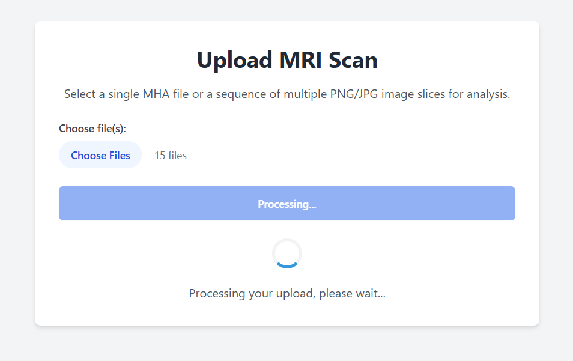
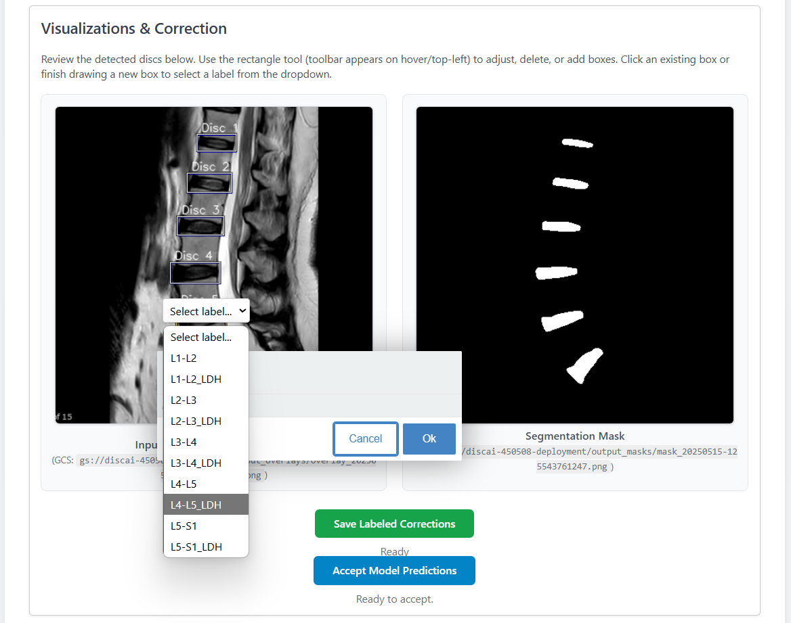
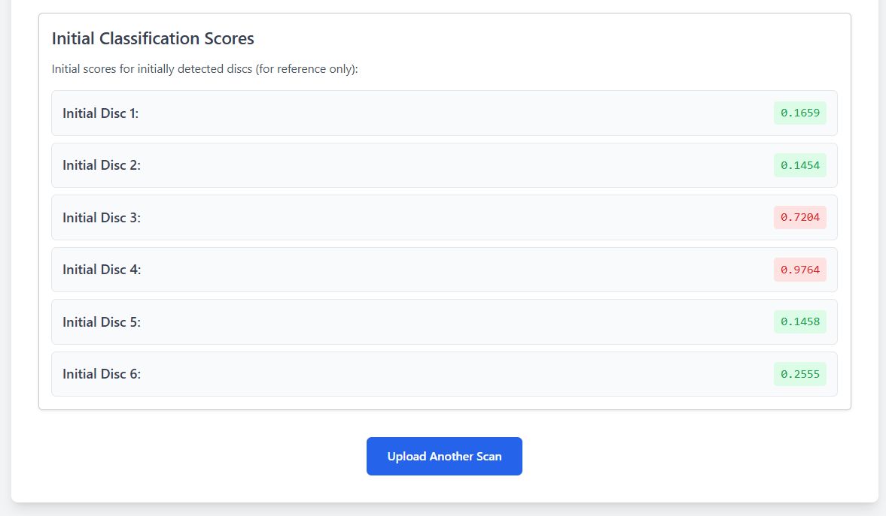
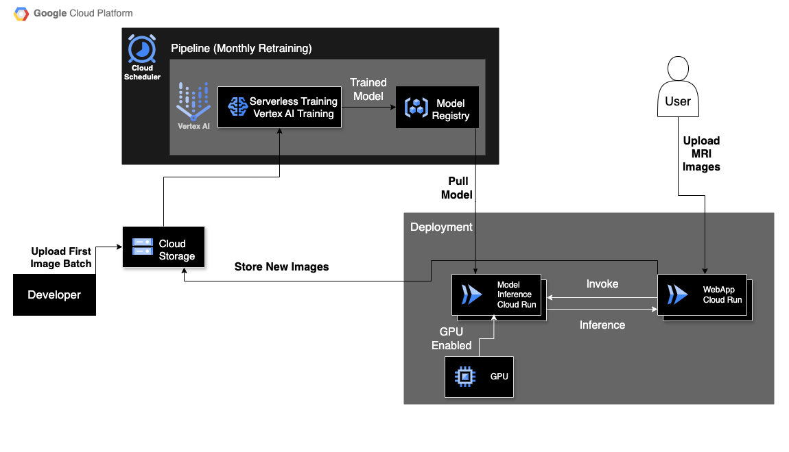

# MRI Lumbar Disc Detection & Classification System

## WebApp
### Upload Interface


### Visualization & Correction Interface


### Results Interface


## System Diagram 


## 1. Overview

This project implements an end-to-end system for the detection and classification of lumbar disc herniation from MRI scans. It features a web-based user interface for uploading MRI data (MHA files or image sequences), an AI-powered backend for performing segmentation and classification, and an MLOps pipeline for continuous model improvement based on user-provided feedback and accepted model predictions. The system is built on Google Cloud Platform (GCP), leveraging services like Vertex AI, Cloud Run, and Google Cloud Storage.

The core functionalities include:
* Automated segmentation of intervertebral discs from MRI slices.
* Automated classification of detected discs for herniation (LDH vs. No LDH), providing a probability score.
* A user-friendly web interface for uploading scans, viewing predictions (segmentation masks, bounding boxes, classification scores), and correcting bounding boxes and labels.
* Mechanisms for users to save either their manual corrections or the model's initial binary predictions if deemed accurate.
* An MLOps pipeline orchestrated by Vertex AI Pipelines to process collected data, retrain the classification model, evaluate its performance, and promote improved models to production.

## 2. System Architecture

The system is composed of several key interacting components:

1.  **Frontend User Interface (Web Application):** Served by a Cloud Run instance, allowing users to upload MRI data and interact with prediction results.
2.  **Backend Services (Cloud Run):**
    * **Upload Service:** Handles file uploads, orchestrates calls to the inference service, and manages the saving of user feedback (corrections or accepted predictions).
    * **Inference Service:** Hosts the trained segmentation and classification models, performs predictions on new data, and returns results.
3.  **MLOps Pipeline (Vertex AI Pipelines):** Automates the retraining and deployment cycle for the classification model.
4.  **Data Storage (Google Cloud Storage - GCS):** Stores all data, including uploaded MRI scans, processed images, model artifacts, user corrections, and pipeline artifacts.
5.  **Containerization & Registry (Docker & Artifact Registry):** All services and pipeline components are containerized using Docker and stored in Google Artifact Registry.
6.  **Infrastructure as Code (Terraform):** GCP resources are managed declaratively using Terraform.


## 3. Technologies and Languages Utilized

* **Cloud Platform:** Google Cloud Platform (GCP)
* **Key GCP Services:**
    * **Vertex AI:** Pipelines (KFP SDK v2), Training, Model Registry
    * **Cloud Run:** For hosting backend Flask services (upload and inference)
    * **Google Cloud Storage (GCS):** For all data and artifact storage
    * **Artifact Registry:** For Docker container image storage
* **Programming Languages:**
    * **Python:** Backend (Flask), ML model development (TensorFlow/Keras), pipeline definition (KFP SDK), component scripts.
    * **HTML, CSS (Tailwind CSS), JavaScript:** Frontend web application.
    * **HCL:** Terraform for Infrastructure as Code.
    * **Bash:** Automation scripts.
    * **YAML:** Configuration (e.g., for Cloud Build image automation).
* **ML/Data Frameworks & Libraries:**
    * **TensorFlow & Keras:** Core ML framework.
    * **Keras Tuner:** For hyperparameter optimization.
    * **Pandas & NumPy:** Data manipulation.
    * **OpenCV & Pillow (PIL):** Image processing.
    * **Annotorious:** JavaScript library for image annotation on the frontend.
    * **Google Cloud Client Libraries:** For Python interaction with GCP services.
* **Web Framework:** Flask (Python)
* **Containerization:** Docker
* **Infrastructure as Code:** Terraform

## 4. Project Directory Structure


```
├── classification/            # Notebooks, scripts, or specific code related to the classification model
├── infrastructure/            # Terraform scripts for GCP resources (main.tf, variables.tf, modules/)
├── models/                    # Saved model artifacts (.keras, .h5 files)
├── scripts/                   # Shell scripts for automation (deployment, pipeline runs, etc.)
├── segmentation/              # Notebooks, scripts, or specific code related to the segmentation model
├── src/
│   ├── common/                # Shared utility scripts/modules (preprocessing_utils.py)
│   ├── data/                  # Scripts related to data processing/preprocessing for pipeline components
│   │   └── preprocess_corrections.py # Example script
│   ├── deployment/
│   │   ├── upload/          # Frontend Cloud Run service (Flask app, HTML templates)
│   │   │   ├── app/
│   │   │   │   ├── main.py
│   │   │   │   └── templates/
│   │   │   │       ├── index.html
│   │   │   │       └── result.html
│   │   │   └── Dockerfile
│   │   └── inference/       # Backend Cloud Run service (Flask app, ML models)
│   │       ├── main.py
│   │       ├── inference_preprocessing_utils.py
│   │       ├── ml_inference_utils.py
│   │       └── Dockerfile
│   ├── evaluation/
│   │   └── evaluate_models.py   # Script for model evaluation pipeline component
│   ├── training/
│   │   └── class_training.py    # Script for classification training pipeline component
│   ├── pipeline.py            # Main Vertex AI Pipeline definition (KFP SDK)
│   └── pipeline_schedule.py   # Script for scheduling pipeline runs 
├── .gitignore                 
└── README.md                  
```

## 5. Setup and Installation

Setting up the full system involves several steps:

1.  **Prerequisites:**
    * Google Cloud SDK (`gcloud`) installed and configured.
    * Docker installed and configured.
    * Terraform CLI installed.
    * Python environment with necessary libraries (for local development/testing).
2.  **Google Cloud Project:** Ensure you have a GCP project with billing enabled and the necessary APIs activated (Cloud Run, Vertex AI, GCS, Artifact Registry, IAM, etc.).
3.  **Infrastructure Deployment:**
    * Navigate to the `infrastructure/` directory.
    * Initialize Terraform: `terraform init`
    * Review and apply the Terraform plan: `terraform apply` (This will provision GCS buckets, IAM service accounts, etc.).
4.  **Environment Variables:**
    * Ensure all required environment variables (e.g., `PROJECT_ID`, `UPLOAD_BUCKET_NAME`, `RESULT_BUCKET_NAME`, `BACKEND_SERVICE_URL`, model URIs for inference service) are set for the Cloud Run services. These are typically configured during deployment.
5.  **Build Docker Images:**
    * Use the provided shell scripts (e.g., `scripts/run-deploy.sh` or `scripts/run-pipeline.sh` which include build steps) or manual Docker commands to build the container images for:
        * Frontend (Upload) Service (`src/deployment/upload/Dockerfile`)
        * Backend (Inference) Service (`src/deployment/inference/Dockerfile`)
        * Pipeline Components (e.g., `src/preprocessing/Dockerfile.preprocess_class`, `src/training/Dockerfile.class`, `src/evaluation/Dockerfile.evaluate`)
    * Push these images to Google Artifact Registry. The scripts often handle this.
6.  **Deploy Cloud Run Services:**
    * Use the `scripts/run-deploy.sh` script (or manual `gcloud run deploy` commands) to deploy the frontend and backend services to Cloud Run, ensuring environment variables are correctly set.
7.  **Prepare Original Processed Data (if applicable):**
    * If your classification model's initial training relies on a pre-processed version of an original dataset (cropped JPEGs + `labels.csv`), ensure this dataset is prepared and uploaded to the GCS locations expected by the training pipeline.

## 6. Running the Application

1.  **Access Frontend:** Once the frontend Cloud Run service (`upload/main.py`) is deployed, access its provided URL in a web browser.
2.  **Upload MRI Scan:**
    * On the `index.html` page, use the file input to select an MHA file or a sequence of JPG/PNG images.
    * Click "Upload and Process."
3.  **View Results & Correct (`result.html`):**
    * The system will display the segmentation mask and an overlay image with detected disc bounding boxes.
    * Initial classification scores (probabilities) for each detected disc will be shown.
    * Use the Annotorious tools on the "Input with Detections (Editable)" image to:
        * Adjust, delete, or add bounding boxes.
        * Assign labels (e.g., "L1-L2_LDH", "L2-L3") to each box using the dropdown.
    * Click **"Save Labeled Corrections"** to save your manual annotations. These will be saved to `gs://<RESULT_BUCKET_NAME>/user_corrected_labels/overlay_{request_id}.txt` in YOLO format (with full class name indices).
    * Alternatively, if the model's initial binary predictions (derived from the scores) appear correct, click **"Save Initial Model Predictions"**. This will save the initial bounding boxes with their corresponding binary (0/1) herniation labels to `gs://<RESULT_BUCKET_NAME>/initial_model_predictions/initial_{request_id}.txt` in YOLO format.

## 7. Running the MLOps Pipeline (Classification Retraining)

The Vertex AI Pipeline is designed to automate the retraining of the classification model using the data collected from user interactions.

1.  **Triggering the Pipeline:**
    * The pipeline can be run manually using the `scripts/run-pipeline.sh` script. This script handles building necessary Docker images for pipeline components, pushing them to Artifact Registry, compiling the Python pipeline definition (`src/pipeline.py`) to JSON, and submitting the job to Vertex AI Pipelines.
    * **Command Example (Classification Retraining only):**
        ```bash
        ./scripts/run-pipeline.sh \
          <project_id> \
          <region> \
          <raw_data_bucket_suffix> \
          <processed_data_bucket_suffix> \
          <pipeline_root_bucket_suffix> \
          <deployment_bucket_suffix_for_corrections_and_originals> \
          "<tensorboard_instance_uri_or_empty_string>" \
          <service_account_email> \
          false
        ```
        
2.  **Pipeline Stages:**
    * **Preprocess Corrections:** Gathers new `.txt` files from `user_corrected_labels/` and `initial_model_predictions/` (prioritizing user corrections for the same `request_id`), processes them with original images, and saves cropped JPEGs and a `labels.csv` to a new GCS location.
    * **Train Classification Model:** Loads the pre-uploaded original processed dataset and the newly processed corrected data. Retrains the classification model using Keras Tuner for hyperparameter optimization. Saves the model to GCS.
    * **Upload Model:** Uploads the trained model to Vertex AI Model Registry.
    * **Evaluate Model:** Compares the new model against the current production model (loaded from a stable GCS path) using a dedicated evaluation dataset.
    * **Conditional Promotion:** If the new model performs better, its files are copied to the stable GCS path used by the production inference service. Optionally, an alias in Model Registry can be updated.

## 8. Key Scripts & Components

* **`src/deployment/upload/main.py`:** Flask application for the frontend service. Handles file uploads, calls the inference service, renders HTML templates, and saves user feedback (corrections and accepted initial predictions) to GCS.
* **`src/deployment/inference/main.py`:** Flask application for the backend inference service. Loads segmentation and classification models, performs predictions on input data (MHA or image sequences), and returns results. Saves MHA-derived slices as JPGs for consistency.
* **`src/pipeline.py`:** Defines the Vertex AI MLOps pipeline using the KFP SDK. Orchestrates data preprocessing, model training, model evaluation, and conditional model deployment.
* **`src/preprocessing/preprocess_corrections.py`:** Python script for the pipeline component that processes user-submitted `.txt` correction files (and accepted initial predictions) and prepares image patches and labels for training.
* **`src/training/class_training.py`:** Python script for the pipeline component that trains/retrains the classification model using TensorFlow/Keras and Keras Tuner.
* **`src/evaluation/evaluate_models.py`:** Python script for the pipeline component that evaluates the newly trained model against the production model.

